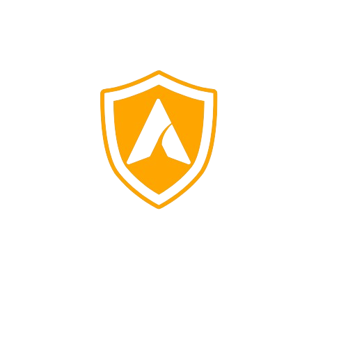

# Header & Footer

<a name="readme-top"/>

<br/>

<br />
<div align="center">
  <a href="https://github.com/Armamentum/">
  <!-- Logo or Image -->
    
  </a>

  <h3 align="center">Seatwork 3: Footer & Header</h3>
</div>

<br />


---

<br />
<br />

<details>
  <summary>Table of Contents</summary>
  <ol>
    <li>
      <a href="#overview">Overview</a>
      <ol>
        <li>
          <a href="#key-components">Key Components</a>
        </li>
        <li>
          <a href="#technology">Technology</a>
        </li>
      </ol>
    </li>
    <li>
      <a href="#rule,-practices-and-principles">Rules, Practices and Principles</a>
    </li>
    <li>
      <a href="#resources">Resources</a>
    </li>
  </ol>
</details>

---

## Overview 

This project showcases a diverse range of animations and styles that can be implemented when designing a website. It highlights the creative possibilities available to developers and designers, focusing on both header and footer sections.

### Key Components
- Header Animation
  - Hover Effect
  - Transform Effect
  - Tilt Effect
  - Flip Effect

- Footer Animations
  - Pulse Effect
  - Slide Effect
  - active Effect
  - transform Effect


### Technology


## Rules, Practices and Principles
1. Always use `WD-` in the front of the Title of the Project for the Subject followed by your custom naming.
2. Do not rename any .html files; always use `index.html` as the filename.
3. Place Files in their respective folders.
4. All file naming are in camel case.
   - Camel case is naming format where there is no white space in separation of each words, the first word is in all lower case while the succeding words first letter are in upper followed by lower cased letters.
   - ex.: buttonAnimatedStyle.css
5. Use only `External CSS`.
6. Renaming of Pages folder names are a must, and relates to what it is doing or data it holding.
7. File Structure to follow below.

```
WD-Seatwork-3
└─ assets
|   └─ css
|   |   └─ style.css
|   └─ img
|       └─ fileWith.jpeg/.jpg/.webp/.png
|
|
└─ pages
|  └─ Header-Gallery
|  |   └─ assets
|  |   |  └─ css
|  |   |  |  └─ style.css
|  |   |  └─ img
|  |   |     └─ fileWith.jpeg/.jpg/.webp/.png
|  |   └─ index.html
|  └─ Footer-Gallery
|     └─ assets
|     |  └─ css
|     |  |  └─ style.css
|     |  └─ img
|     |     └─ fileWith.jpeg/.jpg/.webp/.png
|     └─ index.html
|
└─ index.html
└─ readme.md
```

## Resources

| Title | Purpose | Link |
|-|-|-|
| Background for Footer | Background image used in footer designs | [wall.alphacoders.com](https://wall.alphacoders.com/wallpaper.php?i=1334948&w=1920&h=1080&type=crop) |
| Social Icons | Icons used for social media links | [flaticon.com](https://www.flaticon.com/) |
| Background for Landing Page and Mortal Kombat Title | Background image for the landing page and Mortal Kombat title | [peakpx.com](https://www.peakpx.com/) |
| Background for Header Gallery | Background image for the header gallery | [thegamer.com](https://www.thegamer.com/mortal-kombat-1-trailer-hints-set-in-present-day/) |
| Tool for Removing Background from Images | Online tool to remove background from images | [remove.bg](https://www.remove.bg/) |
| Johnny Cage Image | Source of the Johnny Cage character image | [pinterest.com](https://ph.pinterest.com/) |
| Mortal Kombat Logo | Source for the Mortal Kombat logo image | [steamgriddb.com](https://www.steamgriddb.com/logo/93580) |